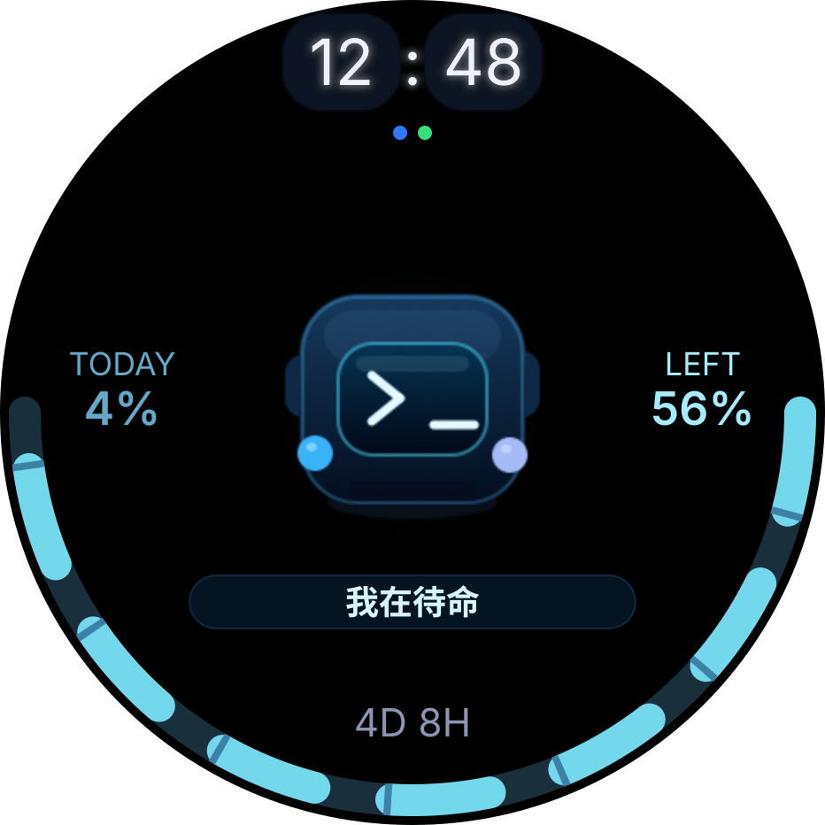

# 功能说明

## 0. 产品概览

M5 StopWatch Codex 是面向桌面 AI 编程工作流的状态屏和语音输入控制器，主要功能包括：

- Codex 额度圆屏页面。
- Codex 未读任务状态和最近四小时活动热力图。
- Codex/Pet 状态动画。
- 顶部下拉电量状态栏。
- BLE GATT 配置和面板 payload。
- BLE HID fallback 按键行为。
- macOS 菜单栏 Bridge。
- Typeless / 微信输入法模式切换。
- 空闲省电和降温策略。

## 1. 系统组成

本项目分成两层：

- 固件层：运行在 M5Stack StopWatch，负责圆屏 UI、宠物动画、电量状态、BLE HID、BLE GATT 配置接收、按键和 IMU 交互。
- macOS Bridge：运行在 Mac 菜单栏，负责连接设备、读取本机 Codex 额度、检测 Typeless 状态、保存用户按键绑定，并把配置同步到固件。

账号、Cookie、token 和桌面焦点只在 Mac 上处理；设备只接收额度摘要和 HID 配置。

## 2. Codex 页面布局

圆屏按 `466 x 466` AMOLED 设计：

| Classic / Pet | OpenWatcher V2 |
| --- | --- |
|  |  |

Classic / Pet 以时间、额度弧线、Pet 动画和状态反馈为核心；OpenWatcher V2 以剩余额度、当天消耗、滚动四小时活动热力图和 Codex 未读任务为核心。

OpenWatcher V2 的界面方向参考了 [OpenWatcher](https://github.com/openwatcher-ai/openwatcher) 的 UI 设计思路，并针对 StopWatch 的 `466 x 466` 圆形 AMOLED、额度信息和实时语音输入流程重新设计。

- 顶部：当前时间，使用低调发光样式。
- 下半圆连续弧线：历史已消耗底轨、08:00 后今日已消耗、当前周剩余额度。
- 左端标签：`TODAY`，显示北京时间 08:00 统计边界后的累计消耗百分点。
- 右端标签：`LEFT`，显示当前周剩余额度。
- 下方居中：周额度刷新倒计时。
- 中央：Pet 主体和状态动画，整体位置略高于圆心。
- 顶部时钟下方：BLE、Wi-Fi 状态点。
- 顶部下拉层：电量状态栏。向下滑显示，向上滑隐藏。

OpenWatcher V2 的活动区域包含 24 个方格，每格代表 10 分钟。时间从左向右推进，每一列按上、下两个方格依次排列；颜色由实际录音时长和录音启动频率共同决定。

电量策略：

- USB 充电插入时短暂显示电量。
- 20% 以下红色常驻。
- 用户可以上滑隐藏 20% 低电提示；隐藏只影响当前提示，不改变电量监测。

## 3. Codex 额度获取机制

推荐路径是 macOS Bridge 通过 BLE 推送：

1. 用户在 Mac 上安装并登录 Codex。
2. Bridge 可选读取 `~/.codex/auth.json`。
3. Bridge 调用 `https://chatgpt.com/backend-api/wham/usage`。
4. Bridge 只保留 604800 秒周窗口；v1.4.0 起每日统计固定为北京时间 08:00 到次日 07:59。
5. Bridge 把周剩余额度、今日累计消耗、重置时间和状态转换成设备面板 payload。
6. 固件通过 BLE GATT 接收 payload、缓存安全摘要并更新 Codex 页面。

固件支持 Wi-Fi panel fallback，默认关闭：

```text
kDefaultWifiEnabled = false
kDefaultWifiQuotaFallbackEnabled = false
```

如果你要启用 Wi-Fi，需要在 `firmware-stopwatch-idf/main/apps/app_codex/codex_config.h` 填入自己的 panel URL 和 Wi-Fi 信息。

## 4. Claude Code 额度获取办法

Claude Code 额度建议只在 macOS 端实现，不放进固件。

参考方式：

- 参考开源项目 `ai-limit` 的 macOS 额度监控思路。
- 读取本机已有登录状态或本机使用记录。
- 在 Mac 端归一化成“剩余额度、窗口重置时间、数据来源、错误状态”。
- 只把摘要推送给 StopWatch，不把 Claude 登录凭据、Cookie、API key、原始日志写入设备。

本项目内的参考文档见 [QUOTA.md](QUOTA.md)。Claude Code 的数据采集可参考 `ai-limit` 或同类 macOS 本机监控工具。

## 5. Pet 建立机制

Pet 不是远程图片，也不是运行时下载资源。它是编译进固件的多帧 LVGL 图片资产：

- 源图或帧图放在 `docs/assets/` 或自定义工作目录。
- 生成脚本把图片转成 `firmware-stopwatch-idf/main/assets/images/*.c`。
- Codex view 根据状态选择帧组播放。

当前状态组包括：

- idle：默认呼吸/待机。
- blink：眨眼。
- touch：触摸反馈。
- processing：输入或处理中。
- msg idle/touch/shake/key/error：消息类动作和反馈。

UI 里 Pet 的框和脸整体略高于圆心，眼睛、脸和双手属于同一套图形坐标，移动时应该一起移动。

## 6. 更换 Pet 形象

推荐流程：

1. 准备统一画布尺寸和透明背景的多帧 PNG。
2. 保持脸、眼睛、手部动作在同一坐标系统里。
3. 用 `firmware-stopwatch-idf/tools/generate_codex_pet_assets.swift` 生成 C 资产。
4. 确认生成文件名仍匹配 `main/CMakeLists.txt` 和 Codex view 引用。
5. `idf.py build`，在设备上检查圆屏裁切、触摸反馈和动画节奏。

更详细步骤见 [PET_CUSTOMIZATION.md](PET_CUSTOMIZATION.md)。

## 7. macOS App 功能

Bridge 菜单栏应用提供：

- 蓝牙连接 `M5Codex-*` 设备。
- 中文设置界面。
- 输入模式切换：Typeless / 微信输入法。
- A 键、B 键、摇晃动作自定义绑定。
- 两套 UI 共用同一套按键交互：Typeless 录音、识别或异常恢复期间，B 键临时等同 A 键；回到 Ready 后才恢复确认/发送。
- F13-F20 固定候选键保留，适合绑定不干扰正常输入的快捷键。
- 其他键可通过用户键盘捕获生成自定义绑定。
- 保存每个输入模式自己的绑定配置。
- 切换模式时恢复对应绑定，并同步到固件。
- Codex 额度推送开关和刷新间隔。
- Codex 未读任务数量和四小时活动摘要同步。
- 可选 Typeless 快捷键同步。
- 开机自启动，不强制保活。

## 8. Typeless 和设备状态栏

Typeless 模式下，Bridge 使用 Accessibility 观察 Typeless 的录音、处理中和完成状态，再把状态同步到设备。真实输入按键通常由设备固件通过 BLE HID 发送；录音链路异常时，Bridge 只模拟一次已配置的 Typeless 快捷键来结束本次听写，已有文字由 Typeless 保留，重连后不会自动续录。

设备状态栏会显示 BLE、语音、额度和错误状态。Accessibility 权限缺失时，Bridge 会进入 limited 状态，设备仍可通过 BLE HID fallback 使用基础按键。

## 9. 按键绑定同步到固件

用户在 App 改动绑定后，Bridge 会把配置写到设备：

- input mode
- primary key / A 键
- confirm key / B 键
- shake action
- 每个键的 HID usage

固件收到后保存到 NVS。这样 App 退出后，设备仍能按最后一次同步配置发送基础 BLE HID。焦点恢复、Typeless 状态识别、Codex 额度推送这些能力仍需要 App 运行。

## 10. 省电机制

当前固件包含分级省电，详细机制见 [POWER_SAVING.md](POWER_SAVING.md)：

- 1 分钟：屏幕降到 10% 亮度，CPU 进入 80MHz 低频配置。
- 3 分钟：关闭 Wi-Fi radio、停止振动、停止 LVGL 更新、屏幕背光归零，并让屏幕进入 activity sleep。
- 15 分钟且未接外部电源：停止显示和无线活动后请求 PMIC 关机。

Wi-Fi 默认关闭；音频输出保留，麦克风输入按需启动。空闲时虚拟输入继续输出静音，但设备停止采集、编码和 BLE 音频通知，以减少麦克风链路功耗。
